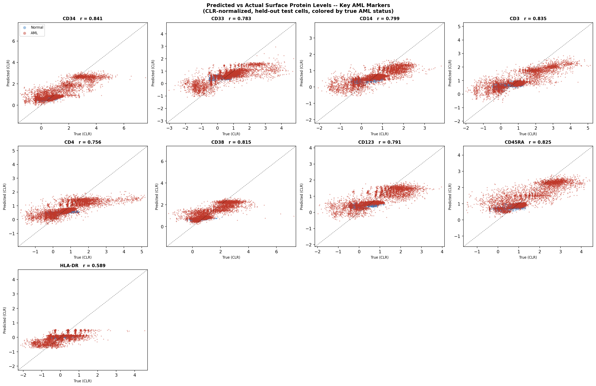

<!-- README.md -->
# DeepOMAPNet



DeepOMAPNet is a deep learning framework for multi-modal single-cell analysis of CITE-seq data. Given RNA expression profiles, it simultaneously predicts surface protein (ADT) levels, classifies cell types, and performs disease diagnosis (AML vs. Normal). It does this by combining Graph Attention Networks (GAT) with cross-modal Transformer Fusion.

---

## What problem does it solve?

CITE-seq experiments measure both RNA and surface protein (ADT) levels in the same cell, but protein measurements are expensive and noisy. DeepOMAPNet learns to predict protein abundance directly from RNA expression while exploiting the cell-cell neighborhood graph structure. It also jointly classifies whether a cell belongs to an AML or Normal sample, sharing representations across both tasks.

---

## How to use it

Start with `Tutorials/Training.ipynb`. It walks through the complete pipeline end-to-end: data loading, normalization, graph construction, model training, and evaluation. This is the recommended starting point for all users.

```bash
jupyter notebook Tutorials/Training.ipynb
```

---

## Architecture

The model processes cells as nodes in a k-nearest-neighbor graph built in PCA space.

```
Raw CITE-seq AnnData (RNA + ADT)
    --> CLR normalization (ADT) + Z-score normalization (both modalities)
    --> Train / val / test split (70 / 15 / 15, stratified)
    --> PCA (50 components) + k-NN graph (k=15) + Leiden clustering
    --> PyTorch Geometric Data objects
    --> GATWithTransformerFusion
    --> ADT predictions  |  AML classification  |  Fused cell embeddings
```

### Model components (`scripts/model/doNET.py`)

| Component | Description |
|---|---|
| `GATWithTransformerFusion` | Top-level model: GAT encoder followed by TransformerFusion and task-specific output heads |
| `GraphPositionalEncoding` | Enriches node embeddings with graph topology signals (node degree, clustering coefficient) |
| `SparseCrossAttentionLayer` | Sparse multi-head cross-attention operating over edge lists; scales to large graphs (>100k cells) |
| `CrossAttentionLayer` | Dense cross-attention variant with layer norm; suitable for smaller graphs |
| `AdapterLayer` | Bottleneck adapter (dim -> dim/r -> dim) for parameter-efficient fine-tuning without retraining the full model |
| `TransformerFusion` | Stacks multiple cross-attention layers to fuse RNA and ADT modalities bidirectionally |

The model produces three outputs:
- `adt_pred` — predicted protein levels per cell (regression)
- `aml_pred` — binary disease classification score per cell
- `fused_embeddings` — latent cell representations usable for downstream analysis (UMAP, clustering)

### Training (`scripts/trainer/gat_trainer.py`)

Training is handled by `train_gat_transformer_fusion()`, which provides:

- Multi-task loss: MSE for ADT regression + BCE for AML classification, with an optional cross-entropy term for cell-type classification
- Stratified train/val/test splits
- Automatic mixed precision (AMP) and gradient accumulation
- Early stopping with best-model restoration

---

## Installation

**Conda (recommended)**

```bash
git clone https://github.com/SreeSatyaGit/DeepOMAPNet.git
cd DeepOMAPNet
conda env create -f environment.yml
conda activate deepomapnet
```

**pip**

```bash
pip install -r requirements.txt
```

Core dependencies: Python 3.8, PyTorch >= 2.0, PyTorch Geometric >= 2.3, ScanPy >= 1.9, AnnData >= 0.9.

---

## Benchmark results

Evaluated on a synthetic CITE-seq benchmark (500 cells, 250 Normal + 250 AML, 30 proteins, 500 genes).

| Metric | Value |
|---|---|
| ADT prediction — mean Pearson r | 0.785 |
| ADT prediction — best single protein r | 0.948 |
| AML classification — AUC-ROC | 0.836 |
| AML classification — F1 | 0.719 |

To reproduce these results:

```bash
python run_experiment.py   # saves figures to results/
```

---

## Repository structure

```
DeepOMAPNet/
├── scripts/
│   ├── model/
│   │   └── doNET.py                 # GATWithTransformerFusion and all model components
│   ├── data_provider/
│   │   ├── data_preprocessing.py    # CLR and Z-score normalization, train/val/test splitting
│   │   ├── graph_data_builder.py    # k-NN graph construction, PCA, PyG Data objects
│   │   └── synthetic_citeseq.py     # Synthetic CITE-seq data generator for testing
│   ├── trainer/
│   │   └── gat_trainer.py           # Multi-task training loop with AMP and early stopping
│   └── visualizations.py            # Plotting utilities
├── Tutorials/
│   └── Training.ipynb               # End-to-end tutorial
├── tests/                           # pytest test suite
├── R/                               # Supporting R scripts (WNN, preprocessing)
├── research/                        # Experiment scripts
├── run_experiment.py                # Synthetic data benchmark
├── environment.yml
└── requirements.txt
```

---

## Synthetic data generator

`scripts/data_provider/synthetic_citeseq.py` provides a biologically realistic CITE-seq generator for testing and benchmarking, without requiring real patient data.

- 7 PBMC and AML cell types with biologically accurate marker profiles
- 30-protein ADT panel (CD3, CD4, CD8, CD14, CD34, CD117, CD33, and others)
- Negative-binomial RNA counts with bimodal ADT expression
- Configurable Normal vs. AML cell proportions

```python
from scripts.data_provider.synthetic_citeseq import generate_citeseq_dataset

ds = generate_citeseq_dataset(n_normal=1000, n_aml=1000, seed=42)
# ds.rna  -- shape [N, 500], log-normalized and z-scored
# ds.adt  -- shape [N, 30],  CLR-normalized
```

---

## Tests

```bash
# Run the full test suite
pytest

# Run a specific test file
pytest tests/test_model_components.py -v
```

| File | Tests | Coverage |
|---|---|---|
| `test_model_components.py` | 36 | Forward pass, gradients, sparse attention, adapters |
| `test_data_pipeline.py` | 25 | Normalization correctness, graph validity, split integrity |
| `test_training.py` | 10 | Loss convergence, gradient clipping, reproducibility |
| `test_performance_benchmark.py` | 16 | Pearson r vs. baselines, Wilcoxon test, AML AUC |

---

## License

MIT. See `LICENSE`.
